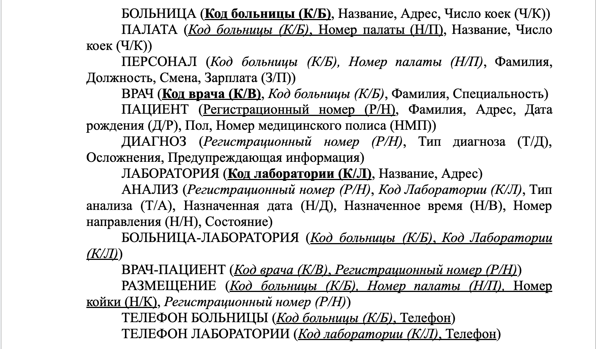

## Техническое задание 

- Развернуть на компьютере реляционную СУБД.
- Создать БД по схеме медицинской базы данных (см. файл ER – схема).
- Повторить в БД ограничения целостности, приведенные на ER-схеме и в описании реляционной схемы медицинской БД (см. файлы  ER – схема, реляционная схема).
- Наполнить БД данными.
- Попытаться сформулировать запросы (в виде текстовых формулировок) к медицинской БД. 

## ER-схема предметной области

## Реляционная схема предметной области

